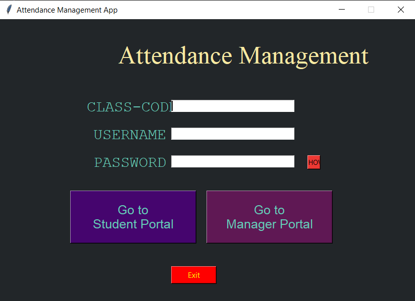
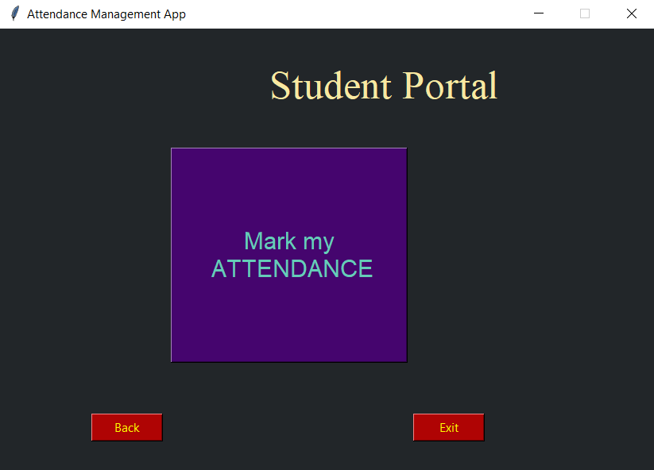
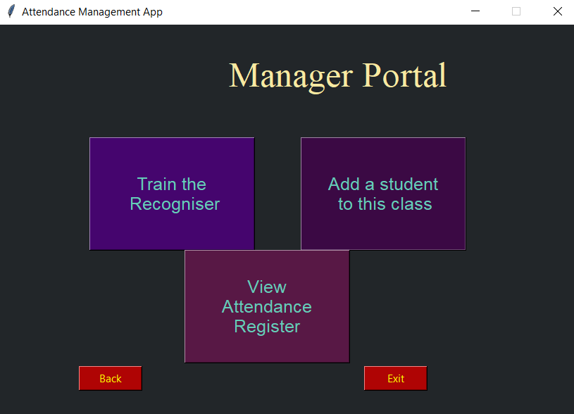

# [Attendance-Management-using-Face-Recognition](https://github.com/Marauders-9998/Attendance-Management-using-Face-Recognition)


[](https://github.com/Marauders-9998/Attendance-Management-using-Face-Recognition/issues)  [](https://github.com/Marauders-9998/Attendance-Management-using-Face-Recognition/network/members)  [](https://github.com/Marauders-9998/Attendance-Management-using-Face-Recognition/stargazers)      [](https://join.slack.com/t/marauders9998/shared_invite/zt-jwafycfo-2yu9tnWlkHcwRX0fdIclpQ)

## Objective
This desktop application aims to simplify the process of Attendance Management of different classes and batches using Face Recognition and user-friendly GUI. The management of data and marking of attendance is carried out in Excel files.

## About the Project
This python based app uses OpenCV libraries: face detection using Haar feature-based cascade classifier and face recognition using Local Binary Patterns Histograms (LBPH) and openpyxl library to manage excel sheet through python scripts. GUI features are implemented using tkinter library.

## About the app
The app has two main Panels: Students' and Manager's



Students' panel has one main feature in marking the attendance



Manager's panel has various features in adding a new class, adding a student to logged-in class, training the recognizer and viewing the attendance register



Captured photo after marking attendance automatically gets added to training data images. If the app somehow fails to recognize a student, the Manager can manually mark a student's attendance in attendance register by looking at the images in unrecognized students directory.
<br/>
**Directory Structure:**
<br/>
./extras - contains the attendance register of different classes and the file containing names of all classes
<br/>
./images - contains the training data images and unrecognized student's directory
<br/>
./student's list - contains the files containing the information of all students of a class

## Usage
```bash
python Attendance_app.py
```
 - use **'Marauders'** as class-code to add classes to the software
 - browse the Manager and Student's Panel using class code of the batch you want to enter with
 - the username is **'ADMIN'** and password **'ubuntu'**
 - use `SPACE-bar` to click images wherever needed
 - you can add more images to the training data manually as well

## Contribution

 Your contributions are always welcome and appreciated. Following are the things you can do to contribute to this project.

 1. **Report a bug** <br>
 If you think you have encountered an issue, and we should know about it, feel free to report it [here](https://github.com/Marauders-9998/Attendance-Management-using-Face-Recognition/issues/new) and we will take care of it.

 2. **Create a pull request** <br>
It can't get better then this, your pull request will be appreciated by the community. You can get started by picking up any open issues from [here](https://github.com/Marauders-9998/Attendance-Management-using-Face-Recognition/issues) and make a pull request.
 
|Label| Description |
|--|--|
| [good first issue](https://github.com/Marauders-9998/Attendance-Management-using-Face-Recognition/labels/good%20first%20issue) | Issues, good for newcomers |
|[easy](https://github.com/Marauders-9998/Attendance-Management-using-Face-Recognition/labels/easy)|Issues with relatively **easy** difficulty|
|[tkinter](https://github.com/Marauders-9998/Attendance-Management-using-Face-Recognition/labels/tkinter)|Issues related to [tkinter](https://docs.python.org/3/library/tk.html) functionalities|
|[openCV](https://github.com/Marauders-9998/Attendance-Management-using-Face-Recognition/labels/openCV)|Issues related to [openCV](https://docs.opencv.org/master/) functionalities|
|[Discussion](https://github.com/Marauders-9998/Attendance-Management-using-Face-Recognition/labels/Discussion)|Issues which demands throrough discussion with community|


 > If you are new to open-source, make sure to check read more about it [here](https://www.digitalocean.com/community/tutorial_series/an-introduction-to-open-source) and learn more about creating a pull request [here](https://www.digitalocean.com/community/tutorials/how-to-create-a-pull-request-on-github).
